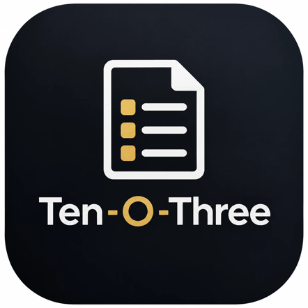
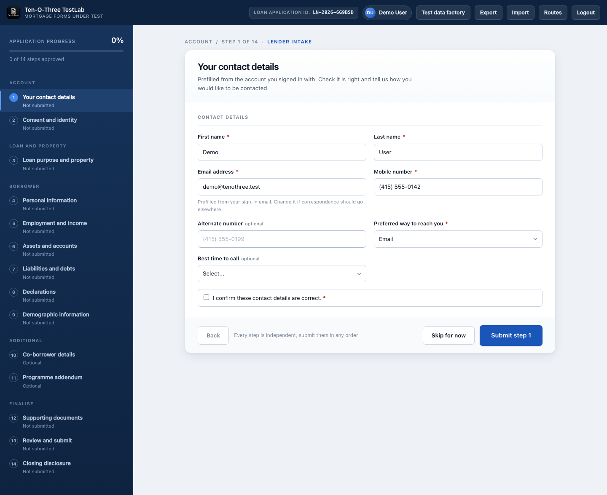
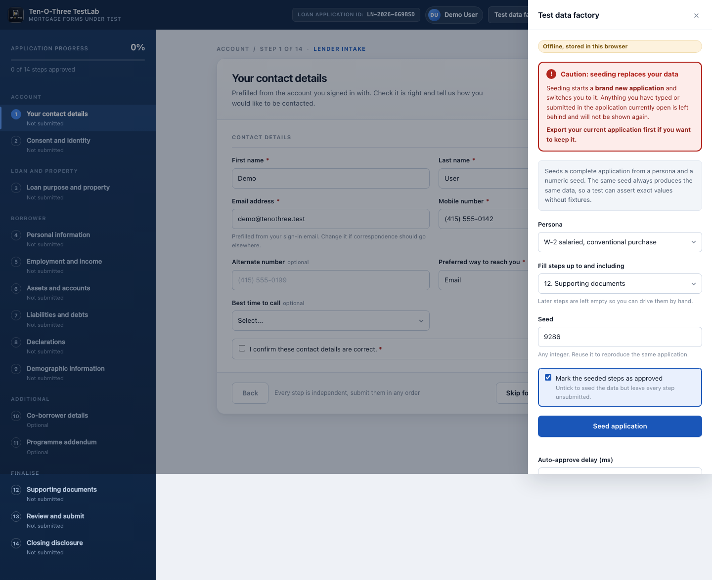
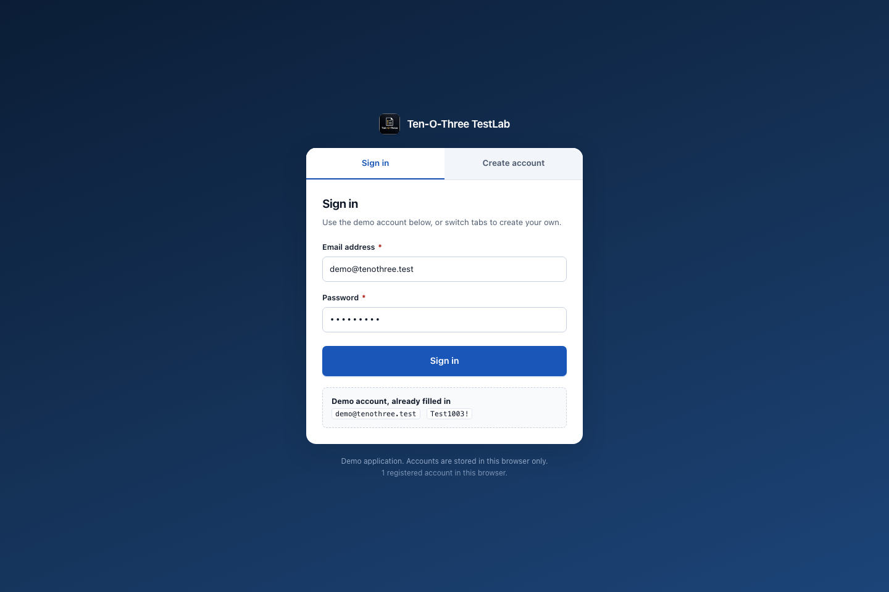

<p align="center">
  
</p>

# Ten-O-Three TestLab v1.0.0

A browser-based mortgage application built for UI automation practice. Ten-O-Three TestLab models a fictional Form 1003 workflow with 14 independent steps, deterministic test data, validation states, deep links, and browser-local persistence.

**One HTML file** · **No installation** · **No server** · **No dependencies**



## Get started

1. Download [`ten-o-three-testlab-v1.0.0.html`](https://github.com/manjunathnp/Ten-O-Three-Test-App/releases/download/v1.0.0/ten-o-three-testlab-v1.0.0.html) from the [v1.0.0 release](https://github.com/manjunathnp/Ten-O-Three-Test-App/releases/tag/v1.0.0).
2. Open the downloaded file in a modern browser.
3. Select **Sign in**. The demo credentials are already filled in.

That is all. The application runs directly from the HTML file and stores its data in the browser's `localStorage`.

## Demo account

| Field | Value |
| --- | --- |
| Email | `demo@tenothree.test` |
| Password | `Test1003!` |

> This is a testing application. The lender and loan workflow are fictional. Do not enter real personal or financial information.

## Features

- Fourteen mortgage application steps that can be opened and submitted independently
- Form 1003-style borrower, employment, asset, liability, declaration, document, review, and closing screens
- Built-in test-data factory with repeatable personas and numeric seeds
- Clear validation summaries, field-level messages, and stable `data-testid` selectors
- Hash-based routes for opening any form directly
- Import and export for reusable application fixtures
- Per-user browser storage with no backend or network requests
- Responsive layout for desktop and smaller screens

## Test-data factory

Open **Test data factory** from the application header, choose a persona, select how many steps to fill, and enter a seed. Reusing the same persona and seed generates the same data, making automated assertions repeatable.



Included personas:

| Persona | Loan programme | Co-borrower |
| --- | --- | --- |
| W-2 salaried | Conventional | No |
| Self-employed | FHA | Yes |
| Active-duty service member | VA | Yes |
| Rural homebuyer | USDA | No |

## Useful routes

The application uses hash routes, so direct links work even when the file is opened locally.

| Route | Opens |
| --- | --- |
| `#/step/1` to `#/step/14` | A step by number |
| `#/personal-info` | Personal information |
| `#/routes` | Complete route index |
| `#/1003` | Form 1003 document view |
| `#/signin` | Sign-in screen |

Example:

```text
ten-o-three-testlab-v1.0.0.html#/step/13?profile=va-active-duty&upTo=12&seed=777&fresh=1&delay=0
```

This opens step 13 with deterministic data already submitted through step 12 and removes the simulated approval delay.

## Automation helpers

| Selector or API | Purpose |
| --- | --- |
| `[data-testid="input-<fieldName>"]` | Locate an input, select, or textarea |
| `[data-testid="btn-submit"]` | Submit the current step |
| `[data-testid="error-summary"]` | Read the current validation summary |
| `[data-testid="progress-pct"]` | Read completion progress |
| `window.__tenothree.factorySeed(profile, upTo, seed, approve)` | Seed an application from the browser console |
| `window.__tenothree.setDelay(0)` | Remove the simulated submit delay |

## Screenshots

### Sign in



### Application workspace


## Project files

```text
Ten-O-Three-Test-App/
├── assets/
│   └── ten-o-three-logo.png
├── ten-o-three-testlab-v1.0.0.html
├── screenshots/
│   ├── application.png
│   ├── sign-in.png
│   └── test-data-factory.png
└── README.md
```

The HTML file contains the complete application, including its logo, styles, and scripts. The separate logo and screenshots are used only by this README and are not required to run the app.

## Release v1.0.0

- Initial public release
- Complete 14-step mortgage application workflow
- Deterministic test-data factory and reusable URL fixtures
- Local sign-in, application persistence, import, and export
- Single-file browser distribution

## Developed by

**Manjunath N P**

[Website](https://manjunathnp.in) · [LinkedIn](https://linkedin.com/in/manjunathnp) · [GitHub](https://github.com/manjunathnp)
